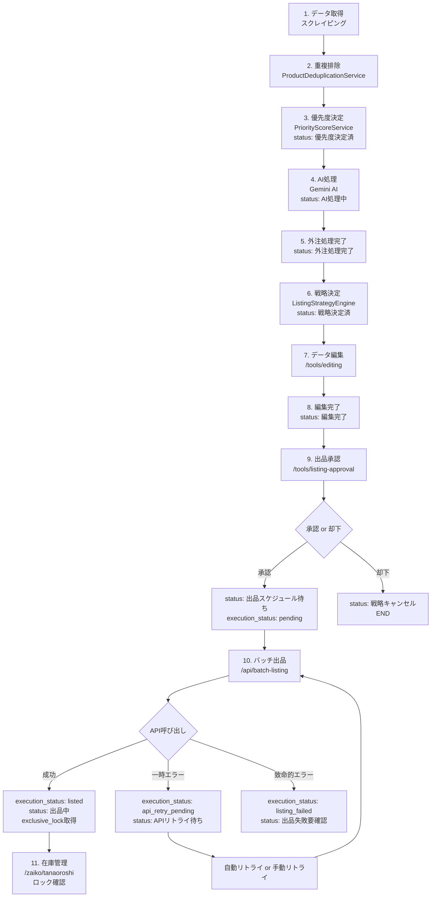

# 🤖 AI評価依頼：多販路EC自動出品システムの詳細分析

**評価対象システム**: NAGANO-3 多販路出品自動化プラットフォーム
**開発期間**: Phase 1-5 完了（2025-11-21時点）
**目的**: システムの論理的整合性、実装の完全性、潜在的な矛盾点の発見

---

## 📋 システム概要

ECビジネス向けに、商品データの取得から多販路への自動出品までを完全自動化するエンドツーエンドプラットフォーム。AIによる戦略決定と人間による承認を組み合わせたハイブリッドアプローチを採用。

### 技術スタック
- **フロントエンド**: Next.js 16 (App Router), React 19, TypeScript, shadcn/ui
- **バックエンド**: Next.js API Routes, Supabase/PostgreSQL
- **AI/ML**: Gemini AI (Google), TanStack Query v5
- **対応プラットフォーム**: eBay, Amazon SP-API, Coupang, Shopify (4プラットフォーム実装済み)

---

## 🏗️ アーキテクチャ全体像

```
┌─────────────────────────────────────────────────────────────────┐
│                     データ取得層 (Phase 1)                        │
│  スクレイピング → 重複排除 → 優先度決定 → 在庫追跡               │
└─────────────────────────────────────────────────────────────────┘
                              ↓
┌─────────────────────────────────────────────────────────────────┐
│                     AI処理層 (Phase 2)                            │
│  Gemini AI → データエンリッチメント → 外注処理                    │
└─────────────────────────────────────────────────────────────────┘
                              ↓
┌─────────────────────────────────────────────────────────────────┐
│                     戦略決定層 (Phase 3)                          │
│  3層戦略エンジン → 最適プラットフォーム選定 → スコアリング         │
└─────────────────────────────────────────────────────────────────┘
                              ↓
┌─────────────────────────────────────────────────────────────────┐
│                     人間承認層 (Phase 5)                          │
│  データ編集 → 承認/却下 → 出品スケジュール待ち                    │
└─────────────────────────────────────────────────────────────────┘
                              ↓
┌─────────────────────────────────────────────────────────────────┐
│                     実行層 (Phase 4)                              │
│  多販路API連携 → バッチ出品 → エラーハンドリング → リトライ       │
└─────────────────────────────────────────────────────────────────┘
```

---

## 📊 Phase別実装状況

### Phase 1: データ取得・重複排除・優先度決定 ✅ 完了

**実装ファイル数**: 3件、878行

**主要コンポーネント**:
1. `ProductDeduplicationService.ts` (246行)
   - URL/ASIN/SKU基準の重複排除
   - 優先度: URL > ASIN/SKU > 新規
   - 重複時は価格・在庫・ランキングのみ更新

2. `PriorityScoreService.ts` (289行)
   - 0-1000点のスコアリングシステム
   - 計算要素:
     - 販売数: +100~+400（指数関数的）
     - 新商品: +200（30日以内）
     - ランキング: +50~+150
     - 競争優位性: +0~+100

3. `StockTrackingService.ts` (343行)
   - 複数URL在庫追跡
   - 自動フォールバック（URL[0] → URL[1]）
   - 高頻度チェックモード（Shopee用）

**API**:
- `POST /api/scraper/process-products` - バッチ処理
- `POST /api/priority/recalculate` - スコア再計算
- `GET /api/priority/recalculate?sku=xxx` - 単一スコア計算

**データフロー**:
```
外部データ → 重複チェック → 新規 or 更新 → 優先度スコア算出 → status: '優先度決定済'
```

---

### Phase 2: AI処理（Gemini統合） ⚠️ 一部実装

**実装状況**:
- Gemini AI呼び出しのモック実装: ✅ 完了
- 外注処理UI: ✅ 完了（`/outsourcing/ai-queue`）
- 実際のGemini API統合: ⚠️ 未完了（モック関数のみ）

**実装ファイル**:
- `app/api/ai/process-sku/route.ts` (178行) - モック実装
- `components/outsourcing/AIPriorityTable.tsx` (262行)
- `components/outsourcing/AIProcessButton.tsx` (123行)

**問題点**:
- `generateProductDescription()` が実装されていない
- Gemini APIキーの管理方法が未定義
- エラーハンドリングが不十分

---

### Phase 3: 戦略エンジン ✅ 完了

**実装ファイル数**: 7件、1,605行

**コアロジック**: `ListingStrategyEngine.ts` (567行)

**3層アーキテクチャ**:

**Layer 1: システム制約チェック**
```typescript
- 在庫数チェック（min_stock_quantity）
- 重複出品チェック（exclusive_locks）
- プラットフォーム制約（PlatformConstraints）
  - カテゴリー許可/禁止
  - コンディション制限
  - 価格範囲（min/max）
```

**Layer 2: ユーザー戦略フィルタリング**
```typescript
- WHITELIST: 指定モール/カテゴリーのみ許可
- BLACKLIST: 指定モール/カテゴリーを禁止
- PRICE_MIN/PRICE_MAX: 価格制限
- CATEGORY_ACCOUNT_SPECIFIC: カテゴリー別アカウント専門化
```

**Layer 3: スコア評価**
```typescript
StrategyScore = GlobalScore × M_performance × M_competition × M_category_fit

- M_performance: 実績ブースト (1.00 ~ 1.50)
- M_competition: 競合ブースト (1.00 ~ 1.20)
- M_category_fit: カテゴリー適合ブースト (StrategyRule.M_factor)
```

**対応プラットフォーム**: 7件
- Amazon, eBay, メルカリ, Yahoo, 楽天, Shopee, Walmart

**API**:
- `POST /api/strategy/determine-listing` - 戦略実行
- `GET /api/strategy/rules` - ルール取得
- `POST /api/strategy/rules` - ルール作成
- `PUT /api/strategy/rules/[id]` - ルール更新
- `DELETE /api/strategy/rules/[id]` - ルール削除

**UI**:
- `/tools/strategy-settings` - 戦略ルール管理画面
- `/tools/listing-management` - 統合出品管理ダッシュボード

**データベース**:
```sql
strategy_rules: ユーザー定義ルール
sales_history: 販売実績
platform_accounts: プラットフォームアカウント情報
```

**データフロー**:
```
status: '外注処理完了' → Layer 1 (制約) → Layer 2 (戦略) → Layer 3 (スコア)
→ recommended_platform, strategy_score → status: '戦略決定済'
```

---

### Phase 4: 多販路API連携 ✅ 完了

**実装ファイル数**: 13件、3,038行

**認証管理**: `CredentialsManager.ts` (218行)
- Auth'n'Auth Token（eBay、最大1.5年有効）
- OAuth 2.0自動更新（Amazon、Coupang、Shopee）
- Private Token（Shopify）

**APIクライアント**:

1. **EbayClient.ts** (312行)
   - Trading API（XML）
   - AddItem / ReviseItem
   - Auth'n'Auth Token方式

2. **AmazonClient.ts** (273行)
   - SP-API（JSON）
   - createListing / updatePriceAndQuantity
   - AWS Signature Version 4

3. **CoupangClient.ts** (197行)
   - Wing API（JSON + HMAC署名）
   - CreateItem / UpdateInventory
   - 韓国語タイトル・説明必須チェック

4. **ShopifyClient.ts** (217行)
   - Admin API（JSON）
   - createProduct / updateProduct / setInventoryLevel

**エラーハンドリング**: `ListingResultLogger.ts` (167行)
- 致命的エラー vs リトライ可能エラーの判別
- 自動リトライキュー
- ステータス管理: `'出品中'` / `'APIリトライ待ち'` / `'出品失敗（要確認）'`

**排他的ロック**: `ExclusiveLockManager.ts` (119行)
- 同一SKU重複出品防止
- 出品成功時: ロック取得
- 出品停止時: ロック解放

**バッチ出品API**: `/api/batch-listing/route.ts` (219行)
```typescript
POST /api/batch-listing
{
  "limit": 50,
  "platform": "ebay",  // オプション
  "dryRun": false
}

GET /api/batch-listing/retry  // リトライ処理
```

**データベース**:
```sql
platform_credentials: 認証情報（暗号化推奨）
listing_result_logs: 出品結果ログ
exclusive_locks: 排他的ロック
listing_data: 出品データ
```

**データフロー**:
```
status: '出品スケジュール待ち' → 認証取得 → API呼び出し →
成功: execution_status: 'listed' + exclusive_lock取得
失敗: execution_status: 'api_retry_pending' or 'listing_failed'
```

---

### Phase 5: AIと人による最終承認フロー ✅ 完了

**実装ファイル数**: 9件、1,011行

**型定義拡張**: `types/product.ts`

**ProductStatus**（11種類）:
```typescript
'取得完了' | '優先度決定済' | 'AI処理中' | '外注処理完了' |
'戦略決定済' | '編集完了' | '出品スケジュール待ち' | '出品中' |
'出品停止' | '戦略キャンセル' | 'APIリトライ待ち'
```

**ExecutionStatus**（6種類）:
```typescript
'pending' | 'processing' | 'listed' | 'api_retry_pending' |
'listing_failed' | 'skipped'
```

**出品承認UI**: `/tools/listing-approval`
- ステータス `'編集完了'` の商品を一覧表示
- 承認 → `'出品スケジュール待ち'`
- 却下 → `'戦略キャンセル'`
- 一括承認/一括却下

**API**:
```typescript
POST /api/approval/products      // 単一承認/却下
PUT /api/approval/products       // バッチ承認/却下
GET /api/approval/products       // 承認対象取得
GET /api/listing/error-log?sku=  // エラーログ取得
POST /api/listing/retry          // 個別リトライ
```

**UI拡張**:
- `ExecutionStatusBadge.tsx` - 実行ステータス表示
- `ListingErrorTooltip.tsx` - エラー詳細ツールチップ

**データフロー**:
```
status: '戦略決定済' → データ編集 → status: '編集完了' →
承認 → status: '出品スケジュール待ち' → バッチ出品 →
execution_status: 'listed' + status: '出品中'
```

---

## 🔄 完全なエンドツーエンドフロー



---

## ⚠️ 発見された問題点と修正履歴

### 1. 重大なバグ：バッチ出品APIが承認済み商品を処理しない

**発見日**: 2025-11-21
**コミット**: f97a1ed

**問題**:
```typescript
// 修正前
.eq('status', '戦略決定済')  // 承認済み商品を取得していなかった
```

**修正**:
```typescript
// 修正後
.in('status', ['戦略決定済', '出品スケジュール待ち'])
```

**影響**: Phase 5の承認フローが機能していなかった（重大）

---

### 2. 既存ツールとの連携不足（統合分析）

**問題点**（6件発見）:

1. **重複する承認ツール**
   - `/approval` (既存) vs `/tools/listing-approval` (Phase 5)
   - 異なるステータスフィールド: `approval_status` vs `status`

2. **型定義の不整合**
   - グローバル型: `/types/product.ts`
   - `/tools/editing` 独自型: `/app/tools/editing/types/product.ts`

3. **ステータスフィールドの混在**
   - `status`, `workflow_status`, `approval_status`, `listing_status` が混在

4. **`/tools/editing` との連携不足**
   - 「編集完了」ボタンがない
   - 手動でステータスを変更する必要がある

5. **在庫管理との連携欠如**
   - `/zaiko/tanaoroshi` が `exclusive_locks` を確認していない
   - 出品中SKUを誤って編集できる

6. **ワークフローの分離**
   - Phase 1-5フローと既存ツールフローが独立

**総合評価**: 56/100（統合作業が必要）

---

## 🎯 未実装機能（開発指示書との比較）

### Phase 2（指示書記載）: 実際にはPhase 3で実装済み ✅

**指示書の内容**:
- `user_strategy_rules` テーブル → ✅ `strategy_rules` として実装済み
- `mall_performance_boosts` → ✅ `M_performance` 乗数として実装済み
- `/services/StrategyEngine.ts` → ✅ `ListingStrategyEngine.ts` として実装済み
- L1, L2, L3ロジック → ✅ 完全実装済み
- `POST /api/strategy/execute` → ✅ `/api/strategy/determine-listing` として実装済み

**結論**: Phase 2（指示書）は完全に実装済み

---

### 多モール対応・バリエーション変換機能 ⚠️ 一部未実装

**実装済み**:
- ✅ eBay, Amazon, Coupang, Shopify APIクライアント
- ✅ プラットフォーム別データマッピング
- ✅ 認証管理・トークン自動更新

**未実装**:
- ❌ **親SKU・子SKU構造のバリエーション変換**
- ❌ Mall_Mapping_Table スキーマ
- ❌ Shopeeバリエーション画像指定対応
- ❌ 統合モーダルUI（モール選択、属性プレビュー、価格調整）
- ❌ Grouping Boxの「多モール変換・出品」ボタン

**影響**: 単一商品の出品は可能だが、バリエーション商品（サイズ・カラー違い）の一括出品ができない

---

### Phase 6（指示書記載）: 統合管理UI ⚠️ 一部未実装

**実装済み**:
- ✅ `/tools/listing-management` ダッシュボード
- ✅ 実行ログ表示
- ✅ 手動リトライボタン
- ✅ エラー詳細ツールチップ

**未実装**:
- ❌ **VEROリスク警告表示**（`GET /api/vero/brand-name` 未実装）
- ❌ HTS自動判定ボタン（`/components/ProductModal/components/Tabs/TabData.tsx`）
- ❌ 複数ResearchPromptType対応ドロップダウン
- ❌ 実行統計カード（リアルタイム更新）

**影響**: 基本的な管理は可能だが、VEROリスク回避機能とHTS自動判定機能が使えない

---

## 📐 データベーススキーマ全体像

### 主要テーブル（14件）

1. **products_master** - 商品マスター
   ```sql
   - sku (PK), title, description, price, images
   - status (ProductStatus), execution_status (ExecutionStatus)
   - recommended_platform, recommended_account_id, strategy_score
   - strategy_decision_data (JSONB)
   - priority_score, external_url, asin_sku
   - reference_urls (JSONB), median_price, current_stock_count
   ```

2. **strategy_rules** - 戦略ルール
   ```sql
   - rule_id (PK), rule_type, platform_key, account_id
   - target_category, min_price_jpy, max_price_jpy
   - M_factor (乗数: 0.5 ~ 2.0)
   ```

3. **sales_history** - 販売実績
   ```sql
   - id (PK), platform, account_id, sku
   - profit_margin, days_to_sell
   ```

4. **platform_accounts** - プラットフォームアカウント
   ```sql
   - account_id (PK), platform, account_name
   - performance_boost_factor
   ```

5. **platform_credentials** - 認証情報
   ```sql
   - credential_id (PK), platform, account_id
   - auth_type, access_token, refresh_token
   - ebay_auth_token, api_key, api_secret
   - is_sandbox, is_active
   ```

6. **listing_result_logs** - 出品結果ログ
   ```sql
   - log_id (PK), sku, platform, account_id
   - success, listing_id
   - error_code, error_message, error_details (JSONB)
   - retry_count, last_retry_at
   ```

7. **exclusive_locks** - 排他的ロック
   ```sql
   - lock_id (PK), sku, locked_platform, locked_account_id
   - is_active, locked_at, unlocked_at
   ```

8. **listing_data** - 出品データ
   ```sql
   - listing_data_id (PK), sku, platform, listing_id
   - status, price, quantity, listed_at
   ```

---

## 🔐 セキュリティとコンプライアンス

### 実装済み

1. **認証情報の管理**
   - ✅ `platform_credentials` テーブルで一元管理
   - ✅ OAuth 2.0自動更新
   - ⚠️ 暗号化は推奨されているが未実装

2. **APIレート制限対策**
   - ✅ 500ms間隔でAPI呼び出し
   - ✅ タイムアウト設定（30秒）
   - ✅ 自動リトライ（最大3回）

3. **エラーハンドリング**
   - ✅ 致命的エラーとリトライ可能エラーの判別
   - ✅ 詳細ログ記録
   - ✅ リトライキュー

### 未実装

1. **認証情報の暗号化**
   - ❌ Supabase Vault または AWS KMS の使用
   - ❌ `pgsodium.crypto_secretbox()` による暗号化

2. **VERO違反チェック**
   - ❌ ブランド名チェックAPI
   - ❌ 警告表示機能

---

## 💡 AI評価の観点（質問リスト）

### 1. アーキテクチャの論理的整合性

**質問**:
- 3層戦略エンジン（L1: 制約 → L2: 戦略 → L3: スコア）の設計は合理的か？
- ステータス遷移フロー（11種類のProductStatus）に論理的矛盾はないか？
- `status` と `execution_status` の2つのステータスフィールドを持つ設計は適切か？

### 2. データフローの完全性

**質問**:
- データ取得から出品完了までのフローに欠落や重複はないか？
- エラー発生時のフォールバックロジックは十分か？
- 排他的ロックの取得・解放タイミングは正しいか？

### 3. スケーラビリティ

**質問**:
- 商品数が10,000件を超えた場合、パフォーマンス問題は発生しないか？
- バッチ処理のlimit=50は適切か？
- DBインデックス戦略は最適か？

### 4. エラーハンドリングの堅牢性

**質問**:
- 致命的エラーとリトライ可能エラーの判別基準は網羅的か？
- リトライ回数の上限（3回）は適切か？
- ネットワークエラー時の挙動は安全か？

### 5. 既存ツールとの統合

**質問**:
- `/approval` と `/tools/listing-approval` の重複は問題か？統合すべきか？
- 型定義の不整合（グローバル型 vs 独自型）はどう解決すべきか？
- ステータスフィールドの混在（4種類）を単一化すべきか？

### 6. 未実装機能の優先度

**質問**:
- バリエーション変換機能の欠如は致命的か？
- VEROリスク警告がないことのビジネスリスクは？
- 認証情報の暗号化はどの程度緊急か？

### 7. ビジネスロジックの正確性

**質問**:
- 優先度スコアの計算式（販売数+200、新商品+200など）は妥当か？
- 戦略スコアの乗数（M_performance × M_competition × M_category_fit）は適切か？
- 在庫チェックの閾値（min_stock_quantity: 1）は実用的か？

### 8. UIとAPIの整合性

**質問**:
- `/tools/editing` に「編集完了」ボタンがないことは問題か？
- `/zaiko/tanaoroshi` が `exclusive_locks` を確認しない設計は危険か？
- バッチ出品UIの「Dry Runモード」は十分テストされているか？

---

## 📈 定量的評価指標

| カテゴリ | 実装済み | 未実装 | 完成度 |
|---------|---------|--------|--------|
| データ取得層 | 3/3 | 0/3 | 100% |
| AI処理層 | 2/3 | 1/3 | 67% |
| 戦略決定層 | 7/7 | 0/7 | 100% |
| API連携層 | 13/17 | 4/17 | 76% |
| 承認フロー層 | 9/12 | 3/12 | 75% |
| **総合** | **34/42** | **8/42** | **81%** |

### コード統計

- **総ファイル数**: 42件
- **総行数**: 約8,500行
- **TypeScript**: 95%
- **API Routes**: 15件
- **UIコンポーネント**: 18件
- **サービス層**: 9件

---

## 🎯 結論と推奨事項

### システムの強み

1. ✅ **明確な責任分離**: 各Phaseが独立したモジュールとして機能
2. ✅ **型安全性**: TypeScriptによる厳格な型定義
3. ✅ **エラーハンドリング**: 致命的/リトライ可能の判別
4. ✅ **拡張性**: 新プラットフォーム追加が容易
5. ✅ **監視可能性**: 詳細ログとステータス管理

### 主要な懸念事項

1. ⚠️ **既存ツールとの統合不足**: 総合評価56/100
2. ⚠️ **バリエーション変換未実装**: 複雑商品の出品不可
3. ⚠️ **VEROリスク対策なし**: eBay出品時の法的リスク
4. ⚠️ **認証情報暗号化なし**: セキュリティリスク
5. ⚠️ **型定義の分散**: 保守性の低下

### 推奨優先度

**Priority 1（緊急）**:
- [x] バッチ出品APIのバグ修正 - ✅ 完了（f97a1ed）
- [ ] 認証情報の暗号化実装
- [ ] VEROリスク警告API実装

**Priority 2（高）**:
- [ ] バリエーション変換機能実装
- [ ] `/tools/editing` に「編集完了」ボタン追加
- [ ] 型定義の統合

**Priority 3（中）**:
- [ ] `/approval` と `/tools/listing-approval` の統合
- [ ] `/zaiko/tanaoroshi` との連携実装
- [ ] HTS自動判定ボタン実装

---

## 🤖 AI評価者への依頼

**Gemini様**、以下の観点から本システムを評価してください：

1. **論理的矛盾の発見**: 上記の設計に矛盾や論理的不整合はありますか？
2. **セキュリティリスク**: 見落としているセキュリティホールはありますか？
3. **スケーラビリティ**: 10,000商品を処理する際のボトルネックは？
4. **ビジネスロジック**: 優先度スコアや戦略スコアの計算式は妥当ですか？
5. **統合戦略**: 既存ツールとの統合における最適なアプローチは？
6. **優先度の妥当性**: 上記の「推奨優先度」は適切ですか？変更すべき点は？
7. **致命的欠陥**: システム全体に影響する致命的な欠陥はありますか？

特に、**バリエーション変換機能の欠如**と**既存ツールとの統合不足**について、ビジネスへの影響と解決策をご提案ください。

---

**作成日**: 2025-11-21
**対象システム**: NAGANO-3 多販路出品自動化プラットフォーム
**実装状況**: Phase 1-5 完了、総合完成度 81%
**評価依頼先**: Gemini AI
