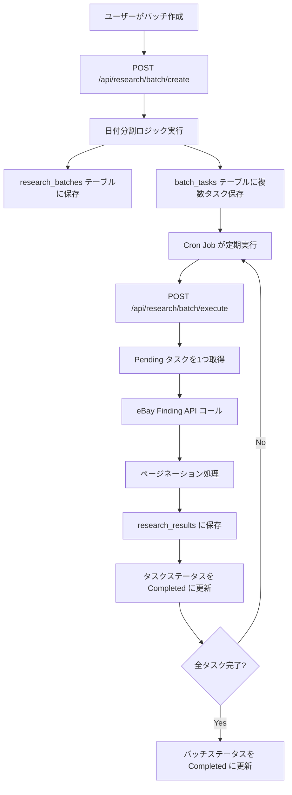

# 大規模データ一括取得バッチ API ドキュメント

## 📋 概要

eBay Finding APIのレート制限を回避しつつ、特定のセラーが販売した大量のSoldデータを日付で細かく分割して取得するバッチAPIです。

## 🌐 エンドポイント

### 1. バッチ作成

**POST** `/api/research/batch/create`

ユーザーが設定したリサーチ条件から、日付分割ロジックにより複数のタスクを生成します。

#### リクエストボディ

```json
{
  "target_seller_ids": ["jpn_seller_001", "jpn_seller_002"],
  "start_date": "2025-08-01",
  "end_date": "2025-10-30",
  "keyword": "Figure",
  "split_unit_days": 7
}
```

| フィールド | 型 | 必須 | 説明 |
|-----------|-----|------|------|
| target_seller_ids | string[] | ✅ | ターゲットセラーIDリスト |
| start_date | string | ✅ | 開始日 (YYYY-MM-DD) |
| end_date | string | ✅ | 終了日 (YYYY-MM-DD) |
| keyword | string | ❌ | 検索キーワード（省略可） |
| split_unit_days | number | ❌ | 分割単位（デフォルト: 7日） |

#### レスポンス例（成功）

```json
{
  "success": true,
  "batch_id": "550e8400-e29b-41d4-a716-446655440000",
  "statistics": {
    "total_sellers": 2,
    "total_days": 91,
    "total_date_ranges": 13,
    "total_tasks": 26,
    "estimated_api_calls": 52
  },
  "message": "バッチ作成完了: 26 件のタスクを生成しました"
}
```

#### 使用例（curl）

```bash
curl -X POST http://localhost:3000/api/research/batch/create \
  -H "Content-Type: application/json" \
  -d '{
    "target_seller_ids": ["seller_001", "seller_002"],
    "start_date": "2025-08-01",
    "end_date": "2025-10-30",
    "keyword": "Figure",
    "split_unit_days": 7
  }'
```

#### 使用例（JavaScript/TypeScript）

```typescript
const response = await fetch('/api/research/batch/create', {
  method: 'POST',
  headers: { 'Content-Type': 'application/json' },
  body: JSON.stringify({
    target_seller_ids: ['seller_001', 'seller_002'],
    start_date: '2025-08-01',
    end_date: '2025-10-30',
    keyword: 'Figure',
    split_unit_days: 7
  })
})

const data = await response.json()
console.log('Batch ID:', data.batch_id)
console.log('Total tasks:', data.statistics.total_tasks)
```

---

### 2. バッチ実行

**POST** `/api/research/batch/execute`

Pending状態のタスクを実行し、eBay Finding APIからデータを取得します。

#### リクエストボディ

```json
{
  "task_id": "optional-specific-task-id",
  "max_tasks": 1
}
```

| フィールド | 型 | 必須 | 説明 |
|-----------|-----|------|------|
| task_id | string | ❌ | 特定タスクのID（省略時は自動選択） |
| max_tasks | number | ❌ | 最大実行タスク数（デフォルト: 1） |

#### レスポンス例（成功）

```json
{
  "success": true,
  "processed": 1,
  "succeeded": 1,
  "failed": 0
}
```

#### 使用例（curl）

```bash
# Pending状態のタスクを1つ実行
curl -X POST http://localhost:3000/api/research/batch/execute \
  -H "Content-Type: application/json" \
  -d '{}'

# 特定のタスクを実行
curl -X POST http://localhost:3000/api/research/batch/execute \
  -H "Content-Type: application/json" \
  -d '{
    "task_id": "550e8400-e29b-41d4-a716-446655440001"
  }'
```

#### VPS上のCron Job設定例

```bash
# 毎時0分に実行（1つのタスクを処理）
0 * * * * curl -X POST http://localhost:3000/api/research/batch/execute -H "Content-Type: application/json" -d '{}'

# 5分ごとに実行（最大3タスクを処理）
*/5 * * * * curl -X POST http://localhost:3000/api/research/batch/execute -H "Content-Type: application/json" -d '{"max_tasks": 3}'
```

---

### 3. バッチステータス取得

**GET** `/api/research/batch/execute?batch_id=<batch_id>`

バッチの進捗状況とタスク一覧を取得します。

#### クエリパラメータ

| パラメータ | 型 | 必須 | 説明 |
|-----------|-----|------|------|
| batch_id | string | ✅ | バッチID |

#### レスポンス例

```json
{
  "success": true,
  "batch": {
    "batch_id": "550e8400-e29b-41d4-a716-446655440000",
    "status": "Processing",
    "total_tasks_count": 26,
    "completed_tasks_count": 10,
    "failed_tasks_count": 0,
    "total_items_retrieved": 3250,
    "created_at": "2025-11-22T10:00:00Z"
  },
  "tasks": [
    {
      "task_id": "550e8400-e29b-41d4-a716-446655440001",
      "target_seller_id": "seller_001",
      "target_date_range": "2025-08-01 to 2025-08-07",
      "status": "Completed",
      "processed_count": 325,
      "total_pages": 4
    }
  ]
}
```

#### 使用例（curl）

```bash
curl "http://localhost:3000/api/research/batch/execute?batch_id=550e8400-e29b-41d4-a716-446655440000"
```

---

### 4. バッチ一覧取得

**GET** `/api/research/batch/create?limit=10`

作成されたバッチの一覧を取得します。

#### クエリパラメータ

| パラメータ | 型 | 必須 | 説明 |
|-----------|-----|------|------|
| limit | number | ❌ | 取得件数（デフォルト: 10） |

#### レスポンス例

```json
{
  "success": true,
  "batches": [
    {
      "batch_id": "550e8400-e29b-41d4-a716-446655440000",
      "status": "Completed",
      "total_tasks_count": 26,
      "completed_tasks_count": 26,
      "total_items_retrieved": 8450,
      "created_at": "2025-11-22T10:00:00Z"
    }
  ]
}
```

---

## 🔄 ワークフロー



## 📊 処理フロー詳細

### バッチ作成時

1. ユーザーがセラーIDリストと期間を指定
2. 期間を7日単位に分割（例: 90日 → 13区間）
3. セラーID × 日付区間 の組み合わせでタスク生成（例: 2セラー × 13区間 = 26タスク）
4. `research_batches` と `batch_tasks` にレコード挿入

### バッチ実行時

1. Pending 状態のタスクを1つ取得
2. タスクのステータスを Processing に更新
3. eBay Finding API をコール（セラーID + 日付範囲でフィルタ）
4. ページネーション処理（100件ずつ取得、最大ページ数まで繰り返し）
5. 取得データを `research_results` に保存
6. タスクのステータスを Completed に更新
7. 次のタスク実行前に5秒待機（レート制限回避）

## ⚠️ 注意事項

1. **レート制限**
   - eBay Finding API の1日の上限: 5,000コール
   - 各タスク実行後、5秒の遅延を挿入

2. **VPS環境での実行**
   - Cron Jobで定期的に `/api/research/batch/execute` を呼び出す
   - 推奨: 1時間に1回、最大3タスクまで処理

3. **データベース権限**
   - Supabase Service Role Key を使用
   - RLS（Row Level Security）が有効

## 🧪 テスト方法

### 1. バッチ作成のテスト

```bash
curl -X POST http://localhost:3000/api/research/batch/create \
  -H "Content-Type: application/json" \
  -d '{
    "target_seller_ids": ["test_seller"],
    "start_date": "2025-08-01",
    "end_date": "2025-08-14",
    "split_unit_days": 7
  }'
```

期待される結果:
- `total_tasks`: 2（2つの7日間区間）
- `batch_id` が返される

### 2. バッチ実行のテスト

```bash
# 上記で取得した batch_id を使用
curl -X POST http://localhost:3000/api/research/batch/execute \
  -H "Content-Type: application/json" \
  -d '{}'
```

期待される結果:
- `processed`: 1
- `succeeded`: 1

### 3. ステータス確認

```bash
curl "http://localhost:3000/api/research/batch/execute?batch_id=<your-batch-id>"
```

## 📚 関連ファイル

- マイグレーションSQL: `/supabase/migrations/`
- バッチ処理ロジック: `/lib/research/batch-processor.ts`
- API実装: `/app/api/research/batch/`
