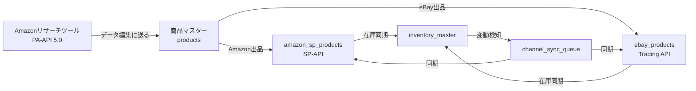

# 多販路統合出品システム 開発計画書
## Phase 1: Amazon SP-API統合 & コア拡張

**プロジェクト名**: NAGANO-3 多販路統合出品システム
**バージョン**: 1.0.0
**作成日**: 2025-10-22
**対象期間**: Phase 1 - 4週間
**目標商品数**: 初期0件 → 3〜5万件（3ヶ月）→ 10万件以上（6ヶ月）

---

## 📊 プロジェクト概要

### 目的
Amazon SP-APIを統合し、eBay・Shopee・Coupang等の複数販路での**在庫・価格・出品データの一元管理**を実現する。

### コアバリュー
1. **1つの商品データ** → 複数販路に自動展開
2. **リアルタイム在庫同期** → 売り切れ・重複販売の防止
3. **統一された商品管理UI** → 効率的な運用
4. **段階的スケール** → 0件から10万件以上へ

---

## 🏗️ システムアーキテクチャ

### 技術スタック決定

```yaml
Frontend:
  - Framework: Next.js 14 (App Router)
  - UI: React 18 + TypeScript
  - Components: shadcn/ui + Tailwind CSS
  - State: React Hooks + Context API

Backend:
  - API: Next.js API Routes
  - Runtime: Node.js 18+
  - Queue: Upstash Redis + Vercel Cron
  - Rate Limiter: Bottleneck.js

Database:
  - Primary: Supabase (PostgreSQL 15+)
  - Cache: Upstash Redis
  - Storage: Supabase Storage (商品画像)

Infrastructure:
  - Hosting: さくらVPS (現行) → Vercel移行検討
  - Process: PM2 (さくらVPS) / Vercel Cron
  - Proxy: Nginx

External APIs:
  - Amazon PA-API 5.0 (リサーチ) ✓ 実装済み
  - Amazon SP-API (在庫管理・出品) ← Phase 1で実装
  - eBay Trading API ✓ 既存実装あり
  - eBay Finding API ✓ 既存実装あり
  - SellerMirror API ✓ 既存実装あり
  - Shopee API (Phase 2)
  - Coupang API (Phase 3)
```

### ディレクトリ構成

```
n3-frontend_new/
├── app/
│   ├── api/
│   │   ├── products/                    # 商品マスター管理
│   │   │   ├── route.ts                 # CRUD API
│   │   │   ├── [id]/route.ts
│   │   │   └── sync/route.ts            # 在庫同期トリガー
│   │   ├── amazon-sp/                   # Amazon SP-API (新規)
│   │   │   ├── auth/route.ts            # SP-API認証
│   │   │   ├── inventory/route.ts       # 在庫同期
│   │   │   ├── listings/route.ts        # 出品管理
│   │   │   ├── content/route.ts         # ASIN整合性チェック
│   │   │   └── reports/route.ts         # レポート取得
│   │   ├── amazon/                      # Amazon PA-API (既存)
│   │   │   ├── search/route.ts          ✓ リサーチ用
│   │   │   └── send-to-editing/route.ts ✓ データ連携
│   │   ├── ebay/                        # eBay API (既存)
│   │   │   ├── search/route.ts          ✓
│   │   │   └── listing/route.ts         ✓
│   │   ├── channels/                    # 販路統合API (新規)
│   │   │   ├── sync-inventory/route.ts  # 全販路在庫同期
│   │   │   └── sync-prices/route.ts     # 全販路価格同期
│   │   └── cron/                        # 定期実行 (新規)
│   │       ├── inventory-sync/route.ts
│   │       └── content-check/route.ts
│   └── tools/
│       ├── amazon-research/             ✓ PA-API リサーチツール
│       ├── inventory-manager/           # 在庫管理ツール (新規)
│       ├── product-master/              # 商品マスター管理 (新規)
│       └── editing/                     ✓ データ編集ページ
├── lib/
│   ├── supabase/
│   │   ├── products.ts                  # 商品マスターDB操作
│   │   ├── amazon-sp.ts                 # Amazon SP-API操作
│   │   └── inventory-sync.ts            # 在庫同期ロジック
│   ├── amazon/
│   │   ├── amazon-api-client.ts         ✓ PA-API (既存)
│   │   ├── sp-api-client.ts             # SP-API (新規)
│   │   └── inventory-service.ts         # 在庫同期サービス
│   ├── ebay/                            ✓ 既存実装
│   └── channels/
│       └── multi-channel-sync.ts        # 販路間同期ロジック
├── types/
│   ├── product.ts                       # 共通商品型 (拡張)
│   ├── amazon.ts                        ✓ PA-API型 (既存)
│   ├── amazon-sp.ts                     # SP-API型 (新規)
│   └── inventory.ts                     # 在庫型 (新規)
├── supabase/migrations/
│   └── 20251022_multi_channel_system.sql # Phase 1マイグレーション
└── docs/
    ├── MULTI_CHANNEL_SYSTEM_PLAN.md     # このファイル
    └── AMAZON_SP_API_SETUP.md           # SP-API認証手順
```

---

## 🗄️ データベース設計

### 設計方針

**既存テーブルとの関係**:
- `yahoo_scraped_products` → Phase 1で**統合・移行**
- `research_results` (eBay) → Phase 1で**統合・移行**
- `amazon_products` (PA-API) → **リサーチ専用として維持**、出品時にマスターへ移行

**新規テーブル構成**:
1. **`products`** - 全販路共通マスター（中心テーブル）
2. **`amazon_sp_products`** - Amazon SP-API専用データ
3. **`ebay_products`** - eBay専用データ
4. **`inventory_master`** - 統合在庫管理
5. **`channel_sync_queue`** - 販路同期キュー

### テーブル定義

#### 1. 商品マスターテーブル (`products`)

```sql
-- ===================================
-- 商品マスター（全販路共通）
-- ===================================
CREATE TABLE products (
    id BIGSERIAL PRIMARY KEY,

    -- 基本識別情報
    master_sku VARCHAR(100) NOT NULL UNIQUE,  -- 自社管理SKU（全販路共通）
    master_key VARCHAR(255) UNIQUE,           -- 重複チェック用ハッシュ

    -- 商品基本情報
    title TEXT NOT NULL,
    title_english TEXT,                       -- 英語タイトル（国際販路用）
    description TEXT,
    description_english TEXT,

    brand VARCHAR(255),
    manufacturer VARCHAR(255),
    model_number VARCHAR(100),

    -- JAN/UPC/EAN統合
    jan_code VARCHAR(13),
    upc_code VARCHAR(12),
    ean_code VARCHAR(13),
    isbn VARCHAR(13),

    -- 寸法・重量
    weight_g INTEGER,
    length_cm DECIMAL(8,2),
    width_cm DECIMAL(8,2),
    height_cm DECIMAL(8,2),
    package_weight_g INTEGER,                 -- 梱包込み重量

    -- 価格管理
    cost_jpy DECIMAL(10,2) NOT NULL,          -- 仕入れ価格（円）
    cost_usd DECIMAL(10,2),                   -- 仕入れ価格（USD）
    base_selling_price_jpy DECIMAL(10,2),     -- 基準販売価格（円）
    base_selling_price_usd DECIMAL(10,2),     -- 基準販売価格（USD）

    -- 在庫管理
    total_stock INTEGER DEFAULT 0,            -- 総在庫数
    reserved_stock INTEGER DEFAULT 0,         -- 予約済み在庫
    available_stock INTEGER GENERATED ALWAYS AS (total_stock - reserved_stock) STORED,

    -- カテゴリ情報
    primary_category_id BIGINT,               -- プライマリカテゴリ
    categories JSONB,                         -- 全カテゴリ情報

    -- 画像管理
    main_image_url TEXT,
    images JSONB,                             -- 複数画像のURL配列

    -- 商品データ
    features JSONB,                           -- 特徴・箇条書き
    specifications JSONB,                     -- 仕様
    keywords TEXT[],                          -- 検索キーワード

    -- 販路連携状態
    channels JSONB DEFAULT '{}',              -- {"amazon": true, "ebay": true, ...}

    -- データソース
    source_platform VARCHAR(50),              -- amazon, ebay, yahoo, manual
    source_item_id TEXT,                      -- 元のソースID（ASIN等）

    -- ステータス
    status VARCHAR(20) DEFAULT 'draft',       -- draft, active, paused, discontinued
    is_active BOOLEAN DEFAULT TRUE,

    -- 優先度・自動化
    sync_priority SMALLINT DEFAULT 5,         -- 1(最高) ~ 10(最低)
    auto_sync_enabled BOOLEAN DEFAULT TRUE,

    -- メタデータ
    user_id UUID REFERENCES auth.users(id),
    created_at TIMESTAMPTZ DEFAULT NOW(),
    updated_at TIMESTAMPTZ DEFAULT NOW(),
    created_by VARCHAR(100),
    updated_by VARCHAR(100),

    -- データ品質
    data_completeness_score SMALLINT,         -- 0-100
    last_verified_at TIMESTAMPTZ,

    -- 検索最適化
    search_vector tsvector GENERATED ALWAYS AS (
        setweight(to_tsvector('english', coalesce(title, '')), 'A') ||
        setweight(to_tsvector('english', coalesce(description, '')), 'B') ||
        setweight(to_tsvector('english', coalesce(brand, '')), 'C')
    ) STORED,

    CONSTRAINT valid_status CHECK (status IN ('draft', 'active', 'paused', 'discontinued')),
    CONSTRAINT valid_priority CHECK (sync_priority BETWEEN 1 AND 10),
    CONSTRAINT positive_stock CHECK (total_stock >= 0 AND reserved_stock >= 0)
);

-- インデックス
CREATE INDEX idx_products_master_sku ON products(master_sku);
CREATE INDEX idx_products_status ON products(status, is_active);
CREATE INDEX idx_products_source ON products(source_platform, source_item_id);
CREATE INDEX idx_products_search ON products USING GIN(search_vector);
CREATE INDEX idx_products_channels ON products USING GIN(channels);
CREATE INDEX idx_products_user ON products(user_id);
CREATE INDEX idx_products_created_at ON products(created_at DESC);

-- 更新日時の自動更新
CREATE TRIGGER update_products_updated_at
    BEFORE UPDATE ON products
    FOR EACH ROW
    EXECUTE FUNCTION update_updated_at_column();

COMMENT ON TABLE products IS '全販路共通の商品マスターデータ';
```

#### 2. Amazon SP-API専用テーブル (`amazon_sp_products`)

```sql
-- ===================================
-- Amazon SP-API商品データ
-- ===================================
CREATE TABLE amazon_sp_products (
    id BIGSERIAL PRIMARY KEY,
    product_id BIGINT NOT NULL REFERENCES products(id) ON DELETE CASCADE,

    -- Amazon識別子
    asin VARCHAR(10) NOT NULL UNIQUE,
    seller_sku VARCHAR(50) NOT NULL UNIQUE,
    marketplace_id VARCHAR(20) DEFAULT 'A1VC38T7YXB528', -- 日本
    fnsku VARCHAR(10),                                   -- FBA用

    -- 商品基本情報
    title TEXT,
    product_type VARCHAR(100),
    brand VARCHAR(255),

    -- ASIN整合性チェック用
    title_hash CHAR(64),
    main_image_url TEXT,
    image_hash CHAR(64),
    bullet_points TEXT[],
    bullet_points_hash CHAR(64),
    last_content_check TIMESTAMPTZ,
    content_changed BOOLEAN DEFAULT FALSE,
    content_change_detected_at TIMESTAMPTZ,

    -- ページ存在確認
    is_active BOOLEAN DEFAULT TRUE,
    listing_status VARCHAR(50),               -- BUYABLE, SUPPRESSED, INCOMPLETE
    last_status_check TIMESTAMPTZ,
    suppression_reason TEXT,
    buybox_eligible BOOLEAN DEFAULT FALSE,

    -- フルフィルメント情報
    fulfillment_channel VARCHAR(10) DEFAULT 'DEFAULT', -- DEFAULT(MFN), AMAZON_NA(FBA)

    -- 在庫情報（SP-API取得データ）
    available_quantity INT DEFAULT 0,
    reserved_quantity INT DEFAULT 0,
    inbound_quantity INT DEFAULT 0,
    unfulfillable_quantity INT DEFAULT 0,
    last_inventory_sync TIMESTAMPTZ,

    -- 価格情報
    current_price DECIMAL(10,2),
    currency VARCHAR(3) DEFAULT 'JPY',
    list_price DECIMAL(10,2),
    business_price DECIMAL(10,2),
    last_price_sync TIMESTAMPTZ,

    -- パフォーマンスデータ
    sales_rank INTEGER,
    sales_rank_category VARCHAR(100),
    bsr_30day_avg INTEGER,

    -- 同期設定
    sync_priority SMALLINT DEFAULT 5,
    sync_interval_hours INT DEFAULT 6,
    last_sync_at TIMESTAMPTZ,
    next_sync_at TIMESTAMPTZ,

    -- エラー管理
    last_sync_error TEXT,
    consecutive_errors INT DEFAULT 0,

    -- メタデータ
    created_at TIMESTAMPTZ DEFAULT NOW(),
    updated_at TIMESTAMPTZ DEFAULT NOW(),

    CONSTRAINT valid_fulfillment CHECK (fulfillment_channel IN ('DEFAULT', 'AMAZON_NA')),
    CONSTRAINT valid_listing_status CHECK (listing_status IN ('BUYABLE', 'SUPPRESSED', 'INCOMPLETE', 'UNKNOWN'))
);

CREATE UNIQUE INDEX idx_amazon_sp_asin ON amazon_sp_products(asin);
CREATE UNIQUE INDEX idx_amazon_sp_seller_sku ON amazon_sp_products(seller_sku);
CREATE INDEX idx_amazon_sp_product_id ON amazon_sp_products(product_id);
CREATE INDEX idx_amazon_sp_next_sync ON amazon_sp_products(next_sync_at) WHERE is_active = TRUE;
CREATE INDEX idx_amazon_sp_priority ON amazon_sp_products(sync_priority, next_sync_at);

CREATE TRIGGER update_amazon_sp_products_updated_at
    BEFORE UPDATE ON amazon_sp_products
    FOR EACH ROW
    EXECUTE FUNCTION update_updated_at_column();

COMMENT ON TABLE amazon_sp_products IS 'Amazon SP-API専用商品データ（セラー・在庫管理）';
```

#### 3. eBay商品テーブル (`ebay_products`)

```sql
-- ===================================
-- eBay商品データ
-- ===================================
CREATE TABLE ebay_products (
    id BIGSERIAL PRIMARY KEY,
    product_id BIGINT NOT NULL REFERENCES products(id) ON DELETE CASCADE,

    -- eBay識別子
    ebay_item_id VARCHAR(50) UNIQUE,          -- 出品後に付与
    seller_sku VARCHAR(50) NOT NULL,

    -- 出品情報
    listing_type VARCHAR(20) DEFAULT 'FixedPrice', -- FixedPrice, Auction
    listing_status VARCHAR(20) DEFAULT 'draft',    -- draft, active, ended

    title VARCHAR(80) NOT NULL,               -- eBay 80文字制限
    subtitle VARCHAR(55),                     -- eBay 55文字制限
    description TEXT,

    -- カテゴリ
    primary_category_id VARCHAR(20),
    secondary_category_id VARCHAR(20),
    category_aspects JSONB,                   -- Item Specifics

    -- 価格・在庫
    start_price DECIMAL(10,2),
    buy_it_now_price DECIMAL(10,2),
    quantity INTEGER DEFAULT 1,

    -- 配送
    shipping_policy_id VARCHAR(50),
    return_policy_id VARCHAR(50),
    payment_policy_id VARCHAR(50),

    -- SellerMirror分析データ
    sm_lowest_price DECIMAL(10,2),
    sm_average_price DECIMAL(10,2),
    sm_competitor_count INTEGER,
    sm_last_analyzed TIMESTAMPTZ,

    -- パフォーマンス
    view_count INTEGER DEFAULT 0,
    watcher_count INTEGER DEFAULT 0,
    sold_count INTEGER DEFAULT 0,

    -- 出品期間
    listed_at TIMESTAMPTZ,
    ended_at TIMESTAMPTZ,
    last_revised_at TIMESTAMPTZ,

    -- 同期設定
    auto_relist BOOLEAN DEFAULT TRUE,
    sync_inventory BOOLEAN DEFAULT TRUE,

    -- メタデータ
    created_at TIMESTAMPTZ DEFAULT NOW(),
    updated_at TIMESTAMPTZ DEFAULT NOW(),

    CONSTRAINT valid_listing_type CHECK (listing_type IN ('FixedPrice', 'Auction', 'StoresFixedPrice')),
    CONSTRAINT valid_listing_status CHECK (listing_status IN ('draft', 'active', 'ended', 'suspended'))
);

CREATE INDEX idx_ebay_product_id ON ebay_products(product_id);
CREATE INDEX idx_ebay_item_id ON ebay_products(ebay_item_id);
CREATE INDEX idx_ebay_status ON ebay_products(listing_status, listed_at);

CREATE TRIGGER update_ebay_products_updated_at
    BEFORE UPDATE ON ebay_products
    FOR EACH ROW
    EXECUTE FUNCTION update_updated_at_column();

COMMENT ON TABLE ebay_products IS 'eBay販路専用商品データ';
```

#### 4. 統合在庫管理テーブル (`inventory_master`)

```sql
-- ===================================
-- 統合在庫管理
-- ===================================
CREATE TABLE inventory_master (
    id BIGSERIAL PRIMARY KEY,
    product_id BIGINT NOT NULL REFERENCES products(id) ON DELETE CASCADE,

    -- 在庫数
    total_stock INTEGER NOT NULL DEFAULT 0,
    reserved_stock INTEGER DEFAULT 0,
    available_stock INTEGER GENERATED ALWAYS AS (total_stock - reserved_stock) STORED,

    -- 販路別予約在庫
    reserved_by_channel JSONB DEFAULT '{}',   -- {"amazon": 5, "ebay": 3, "shopee": 2}

    -- 倉庫・ロケーション
    warehouse_location VARCHAR(100),
    shelf_location VARCHAR(50),

    -- 在庫しきい値
    minimum_stock INTEGER DEFAULT 0,
    reorder_point INTEGER DEFAULT 5,
    optimal_stock INTEGER,

    -- 在庫ステータス
    is_low_stock BOOLEAN GENERATED ALWAYS AS (available_stock <= minimum_stock) STORED,
    is_out_of_stock BOOLEAN GENERATED ALWAYS AS (available_stock = 0) STORED,

    -- 入荷予定
    incoming_stock INTEGER DEFAULT 0,
    expected_arrival_date DATE,

    -- 最終同期
    last_sync_at TIMESTAMPTZ,
    last_sync_source VARCHAR(50),             -- amazon, ebay, manual

    -- メタデータ
    created_at TIMESTAMPTZ DEFAULT NOW(),
    updated_at TIMESTAMPTZ DEFAULT NOW(),

    CONSTRAINT positive_inventory CHECK (total_stock >= 0 AND reserved_stock >= 0),
    UNIQUE(product_id)
);

CREATE INDEX idx_inventory_product_id ON inventory_master(product_id);
CREATE INDEX idx_inventory_low_stock ON inventory_master(is_low_stock) WHERE is_low_stock = TRUE;
CREATE INDEX idx_inventory_out_of_stock ON inventory_master(is_out_of_stock) WHERE is_out_of_stock = TRUE;

CREATE TRIGGER update_inventory_master_updated_at
    BEFORE UPDATE ON inventory_master
    FOR EACH ROW
    EXECUTE FUNCTION update_updated_at_column();

COMMENT ON TABLE inventory_master IS '全販路統合在庫管理テーブル';
```

#### 5. 在庫変動履歴テーブル (`inventory_history`)

```sql
-- ===================================
-- 在庫変動履歴
-- ===================================
CREATE TABLE inventory_history (
    id BIGSERIAL PRIMARY KEY,
    product_id BIGINT NOT NULL REFERENCES products(id) ON DELETE CASCADE,

    -- 在庫変動
    old_total INTEGER NOT NULL,
    new_total INTEGER NOT NULL,
    quantity_delta INTEGER GENERATED ALWAYS AS (new_total - old_total) STORED,

    old_reserved INTEGER DEFAULT 0,
    new_reserved INTEGER DEFAULT 0,

    -- 変動理由
    change_type VARCHAR(30) NOT NULL,         -- sync, adjustment, order, return, damage
    change_source VARCHAR(50),                -- amazon_sp_api, ebay_api, manual
    channel VARCHAR(20),                      -- amazon, ebay, shopee, manual

    -- 参照情報
    reference_id VARCHAR(100),                -- 注文ID、同期ID等
    reference_url TEXT,

    -- 販路間同期状態
    synced_to_channels JSONB,                 -- {"amazon": true, "ebay": false}
    sync_completed_at TIMESTAMPTZ,

    -- メタデータ
    note TEXT,
    performed_by VARCHAR(100),
    created_at TIMESTAMPTZ DEFAULT NOW(),

    CONSTRAINT valid_change_type CHECK (change_type IN (
        'sync', 'adjustment', 'order', 'return', 'damage', 'restock', 'transfer'
    ))
);

CREATE INDEX idx_inventory_history_product ON inventory_history(product_id, created_at DESC);
CREATE INDEX idx_inventory_history_channel ON inventory_history(channel, created_at DESC);
CREATE INDEX idx_inventory_history_type ON inventory_history(change_type, created_at);

COMMENT ON TABLE inventory_history IS '在庫変動履歴（全販路統合）';
```

#### 6. 販路同期キュー (`channel_sync_queue`)

```sql
-- ===================================
-- 販路同期キュー
-- ===================================
CREATE TABLE channel_sync_queue (
    id BIGSERIAL PRIMARY KEY,
    product_id BIGINT NOT NULL REFERENCES products(id) ON DELETE CASCADE,

    -- 同期対象
    channel VARCHAR(20) NOT NULL,             -- amazon, ebay, shopee, all
    sync_type VARCHAR(20) NOT NULL,           -- inventory, price, content, full

    -- 優先度
    priority SMALLINT DEFAULT 5,

    -- スケジュール
    scheduled_at TIMESTAMPTZ DEFAULT NOW(),
    started_at TIMESTAMPTZ,
    completed_at TIMESTAMPTZ,

    -- ステータス
    status VARCHAR(20) DEFAULT 'pending',     -- pending, processing, completed, failed, retry
    retry_count INT DEFAULT 0,
    max_retries INT DEFAULT 3,

    -- 同期データ
    sync_payload JSONB,                       -- 同期するデータ

    -- 結果
    result JSONB,
    error_code VARCHAR(50),
    error_message TEXT,

    -- メタデータ
    created_at TIMESTAMPTZ DEFAULT NOW(),

    CONSTRAINT valid_channel CHECK (channel IN ('amazon', 'ebay', 'shopee', 'coupang', 'all')),
    CONSTRAINT valid_sync_type CHECK (sync_type IN ('inventory', 'price', 'content', 'full')),
    CONSTRAINT valid_status CHECK (status IN ('pending', 'processing', 'completed', 'failed', 'retry'))
);

CREATE INDEX idx_channel_sync_status ON channel_sync_queue(status, scheduled_at, priority);
CREATE INDEX idx_channel_sync_product ON channel_sync_queue(product_id, channel);
CREATE INDEX idx_channel_sync_pending ON channel_sync_queue(scheduled_at) WHERE status IN ('pending', 'retry');

COMMENT ON TABLE channel_sync_queue IS '販路間同期キュー（在庫・価格・コンテンツ）';
```

#### 7. Amazon API設定テーブル (`amazon_sp_config`)

```sql
-- ===================================
-- Amazon SP-API設定
-- ===================================
CREATE TABLE amazon_sp_config (
    id SERIAL PRIMARY KEY,

    -- マーケットプレイス
    marketplace_id VARCHAR(20) NOT NULL,
    marketplace_name VARCHAR(50),
    region VARCHAR(10) NOT NULL,              -- na, eu, fe

    -- SP-API認証（暗号化推奨）
    refresh_token TEXT NOT NULL,
    lwa_client_id VARCHAR(255) NOT NULL,
    lwa_client_secret TEXT NOT NULL,

    -- AWS認証
    aws_access_key_id VARCHAR(255) NOT NULL,
    aws_secret_access_key TEXT NOT NULL,
    role_arn TEXT,

    -- アクセストークン管理
    access_token TEXT,
    access_token_expires_at TIMESTAMPTZ,

    -- レート制限設定
    rate_limits JSONB,                        -- エンドポイント別レート制限

    -- ステータス
    is_active BOOLEAN DEFAULT TRUE,
    last_token_refresh TIMESTAMPTZ,
    last_health_check TIMESTAMPTZ,
    health_status VARCHAR(20) DEFAULT 'unknown',

    -- メタデータ
    created_at TIMESTAMPTZ DEFAULT NOW(),
    updated_at TIMESTAMPTZ DEFAULT NOW(),

    CONSTRAINT valid_region CHECK (region IN ('na', 'eu', 'fe')),
    CONSTRAINT valid_health CHECK (health_status IN ('healthy', 'degraded', 'unhealthy', 'unknown'))
);

CREATE UNIQUE INDEX idx_sp_config_marketplace ON amazon_sp_config(marketplace_id) WHERE is_active = TRUE;

CREATE TRIGGER update_amazon_sp_config_updated_at
    BEFORE UPDATE ON amazon_sp_config
    FOR EACH ROW
    EXECUTE FUNCTION update_updated_at_column();

COMMENT ON TABLE amazon_sp_config IS 'Amazon SP-API認証設定（暗号化推奨）';
```

#### 8. API呼び出しログ (`api_call_logs`)

```sql
-- ===================================
-- API呼び出しログ（全販路統合）
-- ===================================
CREATE TABLE api_call_logs (
    id BIGSERIAL PRIMARY KEY,

    -- API情報
    platform VARCHAR(20) NOT NULL,            -- amazon, ebay, shopee
    endpoint VARCHAR(100) NOT NULL,
    operation VARCHAR(100) NOT NULL,
    http_method VARCHAR(10),

    -- リクエスト
    request_params JSONB,
    request_time TIMESTAMPTZ DEFAULT NOW(),

    -- レスポンス
    response_time_ms INT,
    status_code INT,

    -- レート制限
    rate_limit_remaining INT,
    rate_limit_reset_at TIMESTAMPTZ,

    -- エラー
    is_error BOOLEAN DEFAULT FALSE,
    error_type VARCHAR(50),
    error_message TEXT,

    -- 関連商品
    product_id BIGINT REFERENCES products(id) ON DELETE SET NULL,

    created_at TIMESTAMPTZ DEFAULT NOW(),

    CONSTRAINT valid_platform CHECK (platform IN ('amazon', 'ebay', 'shopee', 'coupang', 'sellermirror'))
);

CREATE INDEX idx_api_logs_platform_time ON api_call_logs(platform, request_time DESC);
CREATE INDEX idx_api_logs_errors ON api_call_logs(is_error, platform, request_time) WHERE is_error = TRUE;
CREATE INDEX idx_api_logs_product ON api_call_logs(product_id) WHERE product_id IS NOT NULL;

-- 30日以上前のログ自動削除（パーティショニング推奨）
CREATE OR REPLACE FUNCTION cleanup_old_api_logs()
RETURNS void AS $$
BEGIN
    DELETE FROM api_call_logs WHERE created_at < NOW() - INTERVAL '30 days';
END;
$$ LANGUAGE plpgsql;

COMMENT ON TABLE api_call_logs IS '全販路API呼び出しログ（レート制限・エラー管理）';
```

---

## 📦 Phase 1: 実装計画（4週間）

### Week 1: 基盤構築 & 認証実装

**目標**: データベース構築、Amazon SP-API認証成功

#### タスク

1. **データベースマイグレーション**
   - [ ] `products`マスターテーブル作成
   - [ ] `amazon_sp_products`テーブル作成
   - [ ] `inventory_master`テーブル作成
   - [ ] `channel_sync_queue`テーブル作成
   - [ ] 既存`yahoo_scraped_products`からのデータ移行スクリプト

2. **Amazon SP-API認証実装**
   - [ ] SP-API Developer Console登録手順書作成 (`docs/AMAZON_SP_API_SETUP.md`)
   - [ ] LWA認証フロー実装 (`lib/amazon/sp-api-client.ts`)
   - [ ] アクセストークン自動更新機能
   - [ ] 認証テストスクリプト (`scripts/test-sp-api-auth.ts`)

3. **型定義作成**
   - [ ] `types/product.ts` 拡張（共通マスター型）
   - [ ] `types/amazon-sp.ts` 作成（SP-API型）
   - [ ] `types/inventory.ts` 作成（在庫型）

4. **基本API Routes**
   - [ ] `/api/products` - 商品マスターCRUD
   - [ ] `/api/amazon-sp/auth` - SP-API認証
   - [ ] `/api/amazon-sp/test-connection` - 接続テスト

**成果物**:
- ✅ データベーススキーマ完成
- ✅ SP-API認証成功
- ✅ 基本CRUD API動作確認

---

### Week 2: 在庫同期機能実装

**目標**: Amazon ↔ マスターの双方向在庫同期

#### タスク

1. **在庫同期サービス実装**
   - [ ] `lib/amazon/inventory-service.ts` - FBA在庫取得
   - [ ] `lib/amazon/inventory-service.ts` - MFN在庫取得
   - [ ] `lib/supabase/inventory-sync.ts` - マスター在庫更新
   - [ ] レート制限管理（Bottleneck.js統合）

2. **API Routes実装**
   - [ ] `/api/amazon-sp/inventory/sync` - 単品同期
   - [ ] `/api/amazon-sp/inventory/batch-sync` - バッチ同期
   - [ ] `/api/products/[id]/sync-inventory` - 全販路同期トリガー

3. **在庫変動履歴**
   - [ ] `inventory_history`への記録ロジック
   - [ ] 在庫変動検知とアラート

4. **Upstash Redis統合**
   - [ ] Redisキュー設定
   - [ ] 在庫同期ジョブ定義

**成果物**:
- ✅ Amazon在庫がマスターに反映
- ✅ 在庫変動履歴が記録
- ✅ バッチ同期が動作

---

### Week 3: ASIN整合性チェック & UI実装

**目標**: コンテンツ検証機能 + 管理UIリリース

#### タスク

1. **コンテンツ検証サービス**
   - [ ] `lib/amazon/content-validator.ts` - ASIN整合性チェック
   - [ ] ハッシュ値計算ロジック（title, image, bullets）
   - [ ] 変更検知とアラート

2. **API Routes**
   - [ ] `/api/amazon-sp/content/validate` - コンテンツ検証
   - [ ] `/api/amazon-sp/listings/status-check` - ページ存在確認

3. **在庫管理UI** (`/tools/inventory-manager`)
   - [ ] 商品一覧ページ（shadcn/ui Data Table）
   - [ ] 在庫同期ボタン
   - [ ] リアルタイム在庫表示
   - [ ] 在庫履歴ビューア

4. **商品マスター管理UI** (`/tools/product-master`)
   - [ ] 商品登録フォーム
   - [ ] 商品編集モーダル
   - [ ] 画像アップロード（Supabase Storage）
   - [ ] 販路連携状態表示

**成果物**:
- ✅ ASIN整合性チェック動作
- ✅ 在庫管理UI完成
- ✅ 商品マスター管理UI完成

---

### Week 4: スケジューラ & テスト

**目標**: 自動同期、統合テスト、本番デプロイ準備

#### タスク

1. **Vercel Cron実装**
   - [ ] `/api/cron/inventory-sync` - 5分ごとの在庫同期
   - [ ] `/api/cron/content-check` - 1時間ごとのコンテンツ検証
   - [ ] `vercel.json` Cron設定

2. **販路間同期ロジック**
   - [ ] `lib/channels/multi-channel-sync.ts` - 統合同期
   - [ ] Amazon在庫更新 → 自動的にeBayも更新

3. **既存ツールとの統合**
   - [ ] Amazon PA-APIリサーチ → 商品マスター登録フロー
   - [ ] データ編集ページ (`/tools/editing`) → 新マスター対応

4. **テスト**
   - [ ] 単体テスト（在庫同期、コンテンツ検証）
   - [ ] 統合テスト（API Routes）
   - [ ] レート制限テスト
   - [ ] エラーハンドリングテスト

5. **ドキュメント整備**
   - [ ] `AMAZON_SP_API_SETUP.md` - 認証取得手順
   - [ ] `INVENTORY_SYNC_GUIDE.md` - 在庫同期ガイド
   - [ ] API仕様書

**成果物**:
- ✅ 自動同期が稼働
- ✅ 全機能テスト完了
- ✅ 本番環境デプロイ可能

---

## 🔄 既存システムとの統合戦略

### PA-API（リサーチ）→ SP-API（出品）フロー



### 統合ポイント

1. **Amazon PA-API（既存）→ 商品マスター**
   - `/api/amazon/send-to-editing` を拡張
   - ASINから商品データ取得 → `products`テーブルに登録
   - `source_platform = 'amazon'`, `source_item_id = ASIN`

2. **データ編集ページ（既存）→ 新マスター対応**
   - `yahoo_scraped_products` → `products`へ移行
   - 既存のSellerMirror分析結果を保持

3. **eBay API（既存）→ 販路統合**
   - 既存`/api/ebay/search`は維持
   - 新規`ebay_products`テーブルで出品管理

---

## 🚀 Phase 2以降の展望（Week 5〜）

### Phase 2: eBay完全統合 & Shopee準備（Week 5-8）
- eBay在庫自動同期
- Shopee API統合準備
- 価格自動調整機能

### Phase 3: Shopee統合（Week 9-12）
- Shopee商品登録
- 多国マーケットプレイス対応（SG, MY, TH）

### Phase 4: スケーリング & 最適化（Week 13-16）
- 3〜5万件対応の最適化
- キャッシュ戦略強化
- パフォーマンス監視

---

## ✅ チェックリスト

### 開発開始前
- [ ] Amazon Professional Seller Account確認
- [ ] SP-API Developer登録
- [ ] Supabaseプロジェクト準備
- [ ] Upstash Redis準備
- [ ] Vercel環境確認

### Phase 1完了条件
- [ ] SP-API認証成功
- [ ] 在庫同期動作（Amazon ↔ Master）
- [ ] ASIN整合性チェック動作
- [ ] 在庫管理UI完成
- [ ] 自動同期スケジューラ稼働
- [ ] 既存ツールとの統合完了

---

## 📞 次のステップ

1. **Amazon SP-API認証情報取得** → `docs/AMAZON_SP_API_SETUP.md`参照
2. **データベースマイグレーション実行**
3. **Week 1タスク開始**

---

**作成者**: Claude Code
**最終更新**: 2025-10-22
**バージョン**: 1.0.0
