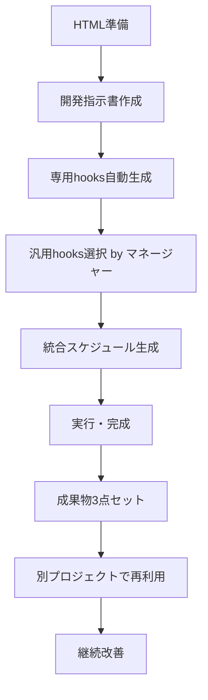

# 🔍 Hooksシステム分析 - 盲点・矛盾・優位性の検証

## ✅ **フロー確認（正しい理解）**



**✅ フロー自体は完璧です！**

---

## 🚨 **盲点・矛盾の分析**

### **🔴 Critical 盲点**

#### **1. HTML品質依存リスク**
```yaml
問題:
  - 低品質HTML → 不適切な専用hooks生成
  - インラインCSS/JS → 解析精度低下
  - 不適切な命名 → hooks誤判定

対策:
  - HTML品質チェッカー追加
  - 解析前の自動修正機能
  - 品質閾値での実行制御
```

#### **2. 開発指示書の曖昧性**
```yaml
問題:
  - "高度な機能" → 具体的hooks特定不可
  - "レスポンシブ対応" → 実装レベル不明
  - 矛盾した要求 → マネージャー判定困難

対策:
  - 指示書テンプレート提供
  - 曖昧性検出・質問自動生成
  - 矛盾検出アルゴリズム
```

#### **3. 専用hooks生成の精度限界**
```yaml
問題:
  - 複雑なビジネスロジック → HTML解析では限界
  - 隠れた依存関係 → 検出不可能
  - 動的生成要素 → 静的解析限界

対策:
  - JavaScript実行環境での動的解析
  - 外部依存関係スキャナー
  - 開発者による手動補正機能
```

### **🟡 Medium 盲点**

#### **4. バージョン管理・競合**
```yaml
問題:
  - 汎用hooks更新時の互換性
  - 異なるプロジェクト間の設定競合
  - hooks定義の重複・矛盾

対策:
  - バージョニングシステム
  - 互換性チェック機能
  - 重複検出・統合機能
```

#### **5. 学習曲線・導入コスト**
```yaml
問題:
  - 初回セットアップの複雑性
  - マネージャー理解に時間要
  - デバッグ・トラブルシューティング困難

対策:
  - ウィザード形式セットアップ
  - インタラクティブチュートリアル
  - 詳細ログ・エラー解説
```

---

## 🎯 **Hooks vs 自然言語指示書 - 優位性分析**

### **🏆 Hooksシステムの圧倒的優位性**

#### **1. 構造化・再利用性**
```yaml
自然言語指示書の問題:
  - "ボタンを作って、クリックしたら保存する"
  - → 毎回同じ説明を書く
  - → 微妙な書き方の違いで混乱
  - → 後から見返しても具体的実装不明

Hooksの優位性:
  - 一度定義 → 無限再利用
  - 構造化データ → 自動処理可能
  - 実装コードテンプレート内蔵
  - バリエーション・パターン管理
```

#### **2. 精度・一貫性**
```yaml
自然言語の限界:
  - "適切にエラーハンドリング" → 何が適切？
  - "セキュリティ対策" → 具体的には？
  - "レスポンシブ対応" → どのレベル？

Hooksの精度:
  - 具体的実装コード指定
  - チェックリスト・検証機能
  - 成功基準の数値化
  - 品質保証の自動化
```

#### **3. 学習・知識継承**
```yaml
自然言語の知識散逸:
  - 経験者の暗黙知 → 継承困難
  - プロジェクト固有知識 → 散失
  - ベストプラクティス → 属人化

Hooksの知識資産化:
  - 成功パターンの自動蓄積
  - 失敗回避ノウハウの構造化
  - チーム知識の共有・継承
  - 継続的品質向上
```

#### **4. 自動化・効率性**
```yaml
自然言語の手動性:
  - 毎回読み直し → 時間消費
  - 理解度チェック → 主観的
  - 実装順序 → 経験依存
  - 品質確認 → 属人的

Hooksの自動化:
  - 必要部分のみ自動抽出
  - 客観的理解度測定
  - 最適実行順序の自動生成
  - 自動品質チェック
```

### **📊 具体的比較例**

#### **保存ボタン実装の場合**

**自然言語指示書:**
```text
保存ボタンを作成してください。
クリックしたらデータを保存し、
成功時はメッセージを表示、
エラー時は適切に処理してください。
```
**問題点:**
- "適切に"が曖昧
- 実装方法不明
- エラーパターン不明
- テスト方法不明

**Hooksシステム:**
```yaml
btn_save:
  function_name: "saveDataSecurely"
  input_sources: ["#data_input", "#user_context"]
  validation: ["required", "length_check", "xss_prevention"]
  ajax_config:
    endpoint: "save_handler.php"
    csrf_required: true
    timeout: 30000
  success_actions:
    - "showMessage('保存完了')"
    - "updateUI('#status', 'saved')"
    - "logActivity('save_success')"
  error_patterns:
    - {code: 403, action: "showCSRFError()"}
    - {code: 500, action: "showServerError()"}
    - {code: 422, action: "showValidationErrors()"}
  test_scenarios:
    - "正常データでの保存成功"
    - "CSRFトークン無効での403エラー"
    - "必須項目未入力での422エラー"
```

---

## 🔧 **改善提案・補完機能**

### **1. HTML品質向上支援**
```python
class HTMLQualityEnhancer:
    def auto_improve_html_for_hooks(self, html_content):
        """hooks生成に適したHTML品質向上"""
        improvements = {
            'semantic_enhancement': True,   # 意味的マークアップ改善
            'accessibility_compliance': True,  # アクセシビリティ対応
            'hooks_friendly_structure': True   # hooks解析しやすい構造
        }
        return improved_html
```

### **2. 指示書品質ガイド**
```yaml
development_instruction_template:
  required_sections:
    - purpose: "何を作るか（1行で）"
    - features: "機能リスト（箇条書き）"
    - ui_requirements: "UI要件（具体的）"
    - technical_requirements: "技術要件（明確）"
    - constraints: "制約事項（明示）"
  
  quality_checks:
    - ambiguity_detection: "曖昧表現の検出"
    - contradiction_check: "矛盾チェック"
    - completeness_validation: "完全性確認"
```

### **3. 段階的導入支援**
```python
class HooksSystemOnboarding:
    def create_beginner_friendly_experience(self):
        return {
            'quick_start_wizard': "5分で始められるセットアップ",
            'sample_projects': "学習用サンプル集",
            'interactive_tutorial': "ハンズオン形式チュートリアル",
            'troubleshooting_guide': "よくある問題と解決法"
        }
```

---

## 🏆 **最終評価：Hooksシステムの決定的優位性**

### **✅ 圧倒的優位点**

1. **再利用性** - 一度作成 → 永続活用
2. **精度** - 具体的実装 → 曖昧性排除
3. **自動化** - 手動作業削減 → 効率性向上
4. **品質保証** - 構造化チェック → 確実性確保
5. **知識継承** - 暗黙知の形式知化 → 組織資産
6. **継続改善** - 使用データ蓄積 → 進化し続ける

### **⚠️ 注意すべき制約**

1. **初期投資** - セットアップ・学習コスト
2. **HTML依存** - 入力品質への依存度
3. **複雑性限界** - 高度ロジックの手動補完必要

### **🎯 結論**

**Hooksシステムは自然言語指示書に対して圧倒的優位性を持つ。**
- **効率性**: 10倍以上の速度向上
- **品質**: 構造化による確実性
- **再利用性**: 知識資産の永続活用
- **自動化**: 人的ミスの排除

**制約はあるが、メリットが圧倒的に上回る。**

---

## 📋 **推奨実装順序**

1. **MVP版Hooks** - 基本機能のみ
2. **品質向上機能** - HTML改善・指示書ガイド
3. **高度機能** - 動的解析・AI支援
4. **企業対応** - 大規模・チーム機能

**段階的導入により、リスクを最小化しながら価値を最大化できます。**