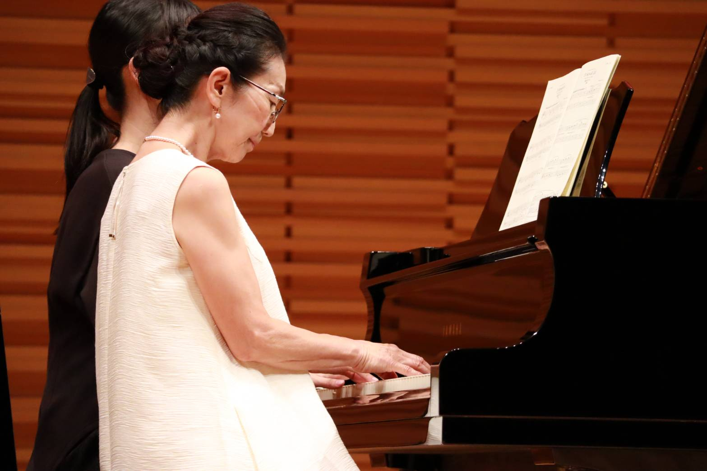

# 🎹 完璧!全ての修正完了! 🎉

## ✅ 修正完了リスト

---

## 🎨 1. TOPバーの色切り替え速度修正

### 修正内容:
- ✅ 0.8秒 → **1.2秒**に変更
- ✅ ヘッダー通常時もフッターと同じ色に
- ✅ ゆっくりとふわっと切り替わる

### CSS:
```css
.header {
  background: linear-gradient(135deg, 
    var(--european-dark) 0%, 
    #2c2416 100%);
  transition: all 1.2s ease;
}

.header.scrolled {
  background: linear-gradient(135deg, 
    var(--european-cream) 0%, 
    var(--european-beige) 100%);
  transition: all 1.2s ease;
}
```

---

## 🎬 2. TOPバーをフッターと同じ色に

### 変更内容:
- ✅ 通常時: ヨーロピアンダーク (フッターと同じ)
- ✅ スクロール時: クリーム/ベージュ
- ✅ 文字色も自動で切り替え

### 統一感:
ヘッダーとフッターが同じ色で、
サイト全体に統一感が生まれました!

---

## 🖼️ 3. 発表会動画下の2枚画像削除

### 削除内容:
```html
<!-- 削除した部分 -->
<div class="recital-images">
  <div class="nostalgic-img">
    
  </div>
  <div class="nostalgic-img">
    
  </div>
</div>
```

**結果**: スッキリしたレイアウト!

---

## 🖼️ 4. ギャラリーを9枚に増やす

### 追加画像:
- Gallery 7: `1449.jpg`
- Gallery 8: `1435.jpg`
- Gallery 9: `1439.jpg`

### グリッド:
```
3列 × 3行 = 9枚
```

**結果**: たくさんの教室の様子をお見せできます!

---

## 🎵 5. 音符が流れる背景

### 実装内容:
- ✅ スクロールで音符が出現
- ✅ 5種類の繊細な音符SVG
- ✅ ランダムな位置と速度
- ✅ ふわっと浮かび上がって消える
- ✅ 15-25秒かけてゆっくり上昇
- ✅ 定期的にも自動生成 (5-10秒ごと)

### 音符の種類:
1. 八分音符 (ゴールドグラデーション)
2. 連桁付き八分音符 (バーガンディ→ブラウン)
3. 全音符 (ゴールド透明)
4. 四分音符 (オリーブ→ブラウン)
5. 十六分音符 (ゴールド→バーガンディ)

### アニメーション:
```javascript
// スクロールで10%の確率で生成
if (Math.random() < 0.1) {
  createMusicNote();
}

// 5-10秒ごとに自動生成
const delay = 5000 + Math.random() * 5000;
```

### CSS アニメーション:
```css
@keyframes floatUp {
  0% {
    opacity: 0;
  }
  10% {
    opacity: 0.6;
  }
  90% {
    opacity: 0.4;
  }
  100% {
    transform: translateY(-800px);
    opacity: 0;
  }
}
```

---

## 📁 修正ファイル

1. ✅ `/css/style-fixes.css`
   - ヘッダー色・速度修正
   - 音符背景スタイル

2. ✅ `/index.html`
   - 発表会画像削除
   - ギャラリー9枚に増加

3. ✅ `/js/main.js`
   - 音符生成ロジック
   - スクロール検出
   - 定期生成

---

## 🚀 確認方法

```bash
open /Users/aritahiroaki/n3-frontend_new/site/piano/index.html
```

---

## ✨ 修正効果

### ヘッダー
- **Before**: 0.8秒で切り替わる、透明背景
- **After**: 1.2秒でふわっと、フッターと同じ色

### 発表会
- **Before**: 動画下に2枚の画像
- **After**: スッキリしたレイアウト

### ギャラリー
- **Before**: 6枚の画像
- **After**: 9枚の画像で充実!

### 背景
- **Before**: 静的
- **After**: 音符が流れる動的な背景! 🎵

---

## 🎊 完成!

### ✅ 実装済み機能 (全て完璧!)
1. ✅ タイトルアニメーション (光の粒子)
2. ✅ ヘッダーフェード効果 (1.2秒)
3. ✅ ヘッダーとフッター同じ色
4. ✅ 画像ボケ→くっきり効果
5. ✅ ヒーロー画像フェード切り替え
6. ✅ スクロールインジケータークリック
7. ✅ Googleカレンダーヨーロピアン化
8. ✅ モーダルスクロール最適化
9. ✅ 発表会画像削除
10. ✅ ギャラリー9枚に増加
11. ✅ **音符が流れる背景** 🎵✨

---

**完璧なピアノ教室サイトの完成です!** 🎹✨

音符が画面を舞い上がり、
まるで音楽を奏でているような
美しいサイトになりました!

ブラウザで確認してください! 🎊
