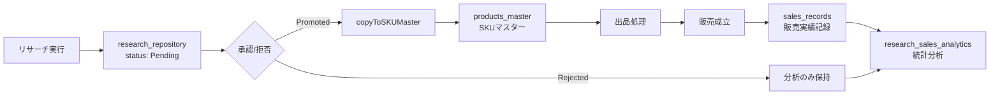

# 📊 統合データ分析基盤: データアーキテクチャ基盤構築（フェーズI）

## 🎯 概要

このマイグレーションは、「リサーチデータ管理システム」のデータ構造を修正し、全データの中心となる**リサーチデータリポジトリ**と、最終成果を記録する**販売実績テーブル**を構築します。

---

## 📁 実装ファイル

### 1. データベーススキーマ
- **`20251122000001_create_research_repository_and_sales_records.sql`**
  - `research_repository` テーブル（全リサーチ履歴と判断結果）
  - `sales_records` テーブル（販売実績ログ）
  - `research_sales_analytics` ビュー（クロス集計用）

### 2. TypeScript型定義
- **`/types/product.ts`**
  - `ReferenceUrl` インターフェース（仕入れ先候補URL）
  - `ResearchStatus` 型（Pending/Promoted/Rejected/Draft）
  - `Product` インターフェースの拡張（新フィールド追加）

### 3. データベース操作関数
- **`/lib/research/research-db.ts`**
  - `insertResearchRecord()` - リサーチレコード挿入
  - `updateResearchStatus()` - ステータス更新
  - `copyToSKUMaster()` - 承認済みデータをSKUマスターへコピー
  - `getResearchRepository()` - リサーチデータ取得（フィルタ付き）
  - `recordSale()` - 販売実績記録
  - `getResearchSalesAnalytics()` - 統計分析用データ取得

---

## 🗄️ テーブル構造

### `research_repository`（リサーチデータリポジトリ）

**役割:** 全てのリサーチ結果とAI解析結果を記録する中心テーブル

| カラム名 | 型 | 説明 |
|---------|-----|------|
| `repository_id` | UUID (PK) | リポジトリID（主キー） |
| `product_id` | UUID (FK) | 商品ID（products_master外部キー） |
| `research_date` | TIMESTAMP | リサーチ日時 |
| `status` | TEXT | ステータス（Pending/Promoted/Rejected/Draft） |
| `title` | TEXT | 商品タイトル |
| `vero_risk_score` | NUMERIC | VEROリスクスコア（0-100） |
| `hts_code` | TEXT | HTS分類コード |
| `priority_score` | NUMERIC | 総合優先度スコア |
| `profit_margin` | NUMERIC | 利益率（%） |
| `reference_urls` | JSONB | 複数の仕入れ先URL |
| `analysis_details` | JSONB | AI解析の詳細ログ |

**インデックス:**
- `status`, `product_id`, `research_date`, `priority_score`, `data_source`

---

### `sales_records`（販売実績テーブル）

**役割:** 実際に売れた商品の最終実績を記録

| カラム名 | 型 | 説明 |
|---------|-----|------|
| `sale_id` | UUID (PK) | 販売ID（主キー） |
| `original_research_id` | UUID (FK) | 元リサーチID（research_repository外部キー） |
| `sale_date` | TIMESTAMP | 販売日時 |
| `marketplace` | TEXT | マーケットプレイス（eBay/Amazon等） |
| `final_selling_price_usd` | NUMERIC | 最終販売価格（USD） |
| `final_profit_margin` | NUMERIC | 最終利益率 |
| `quantity_sold` | INTEGER | 販売数量 |

**インデックス:**
- `original_research_id`, `sale_date`, `marketplace`

---

### `research_sales_analytics`（統計分析ビュー）

**役割:** リサーチと販売実績を結合したクロス集計用ビュー

リサーチデータと販売実績をLEFT JOINで結合し、以下を含む：
- リサーチ基本情報（タイトル、日付、ステータス、スコア）
- 販売実績フラグ（`has_sales`）
- 最終販売価格と利益率

---

## 🚀 使用方法

### 1. マイグレーション実行

```bash
# Supabase CLIを使用する場合
supabase migration up

# または、Supabaseダッシュボードから手動で実行
# 1. Supabaseダッシュボードにログイン
# 2. SQL Editorを開く
# 3. マイグレーションファイルの内容を貼り付けて実行
```

### 2. リサーチレコードの挿入

```typescript
import { insertResearchRecord } from '@/lib/research/research-db'
import type { Product } from '@/types/product'

const productData: Partial<Product> = {
  title: 'Vintage Camera Lens',
  english_title: 'Vintage Camera Lens',
  price: 15000,
  cost: 8000,
  profit: 7000,
  research_status: 'Pending',
  priority_score: 85.5,
  hts_code: '9006.53',
  external_url: 'https://example.com/product',
  reference_urls: [
    { url: 'https://supplier1.com', price: 7500 },
    { url: 'https://supplier2.com', price: 8000 }
  ]
}

const result = await insertResearchRecord(productData)
if (result.success) {
  console.log('リサーチレコードID:', result.repository_id)
}
```

### 3. ステータス更新（承認/拒否）

```typescript
import { updateResearchStatus, copyToSKUMaster } from '@/lib/research/research-db'

// ステータスを「Promoted」に更新
const updateResult = await updateResearchStatus('repository-id-xxx', 'Promoted')

if (updateResult.success) {
  // SKUマスターにコピー
  const copyResult = await copyToSKUMaster('repository-id-xxx')

  if (copyResult.success) {
    console.log('SKUマスターにコピー完了:', copyResult.product_id)
  }
}
```

### 4. 販売実績の記録

```typescript
import { recordSale } from '@/lib/research/research-db'
import type { SalesRecord } from '@/lib/research/research-db'

const saleData: SalesRecord = {
  original_research_id: 'repository-id-xxx',
  marketplace: 'eBay',
  final_selling_price_usd: 25.99,
  final_profit_margin: 35.5,
  final_profit_amount_usd: 9.22,
  quantity_sold: 1,
  sold_title: 'Vintage Camera Lens - Sold',
  buyer_country: 'US'
}

const result = await recordSale(saleData)
if (result.success) {
  console.log('販売実績記録完了:', result.data.sale_id)
}
```

### 5. 統計分析データの取得

```typescript
import { getResearchSalesAnalytics } from '@/lib/research/research-db'

const analyticsResult = await getResearchSalesAnalytics()

if (analyticsResult.success) {
  const data = analyticsResult.data

  // 販売実績のある商品のみフィルタ
  const soldItems = data.filter(item => item.has_sales)

  // 成功率の計算
  const successRate = (soldItems.length / data.length) * 100
  console.log(`リサーチ成功率: ${successRate.toFixed(2)}%`)
}
```

---

## 🔄 データフロー

### リサーチ → 承認 → 出品 → 販売



---

## ⚠️ 注意事項

### 1. マイグレーション実行前の確認

- **`products_master` テーブルが存在すること**
  - 外部キー制約があるため、事前に作成されている必要があります

- **UUID拡張が有効化されていること**
  - PostgreSQLで `uuid_generate_v4()` を使用するため、以下を実行：
  ```sql
  CREATE EXTENSION IF NOT EXISTS "uuid-ossp";
  ```

### 2. ステータス管理の厳守

- **Promoted（承認）:** SKUマスターにコピーされ、出品対象となる
- **Rejected（拒否）:** 統計分析のみに使用
- **Pending（保留）:** 未承認（デフォルト）
- **Draft（下書き）:** 未完了のリサーチ

### 3. 型安全性の維持

- 全てのDB操作は `Product` インターフェースを経由
- TypeScriptの型チェックを活用し、フィールド名の誤りを防ぐ

---

## 📈 次のフェーズ

### フェーズII: UIソースの変更
- 既存マスター表示UIのデータソースを `products_master` から `research_repository` に切り替え
- 承認/拒否UIの実装

### フェーズIII: 統計分析ダッシュボード
- `/app/tools/research-analytics/page.tsx` を実データに接続
- クロス集計機能の拡張（販売実績相関、サイト別貢献度）

---

## 🧪 動作確認

### マイグレーション確認

```sql
-- テーブルが作成されているか確認
SELECT table_name
FROM information_schema.tables
WHERE table_schema = 'public'
AND table_name IN ('research_repository', 'sales_records');

-- ビューが作成されているか確認
SELECT table_name
FROM information_schema.views
WHERE table_schema = 'public'
AND table_name = 'research_sales_analytics';
```

### データ挿入テスト

```typescript
// テストデータの挿入と確認
const testData: Partial<Product> = {
  title: 'Test Product',
  research_status: 'Pending',
  priority_score: 50
}

const result = await insertResearchRecord(testData)
console.log('挿入成功:', result.success)
```

---

## 📚 関連ドキュメント

- [統合データ分析基盤 開発指示書（マスター）](../../docs/data-analysis-platform-master.md)
- [Supabase公式ドキュメント](https://supabase.com/docs)
- [PostgreSQL公式ドキュメント](https://www.postgresql.org/docs/)

---

**作成日:** 2025-11-22
**バージョン:** 1.0.0
**担当:** Claude Code (Anthropic)
